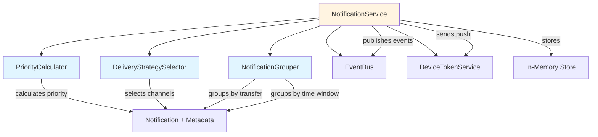

# Design Document: Smart Notification Prioritization

## Overview

This design extends the existing notification system in Swift Send to support priority-based categorization, intelligent delivery strategies, and notification grouping. The enhancement addresses notification fatigue by ensuring critical alerts receive immediate attention while grouping less urgent notifications.

### Current System

The existing `NotificationService` provides:
- In-memory notification storage per user
- Multi-channel delivery (email, SMS, in-app, push)
- Event-driven architecture via `EventBus`
- Basic notification types: success, error, warning, info
- Simple chronological sorting (newest first)
- Push notification support via FCM through `deviceTokenService`

### Design Goals

1. **Priority-aware delivery**: Route notifications through appropriate channels based on urgency
2. **Intelligent grouping**: Reduce notification fatigue by grouping related notifications
3. **Backward compatibility**: Existing notifications continue to work without modification
4. **Performance**: Maintain sub-50ms response times for priority calculation and grouping
5. **Extensibility**: Support future priority levels and grouping strategies

### Key Design Decisions

**Priority as a derived property**: Priority is calculated from notification type and metadata rather than stored separately. This ensures consistency and simplifies backward compatibility with existing notifications.

**Two-tier grouping strategy**: Support both transfer-based grouping (explicit relationships) and time-window grouping (implicit relationships) to handle different notification patterns.

**Immutable notification core**: Priority and grouping metadata are computed at read time, preserving the existing notification structure and storage mechanism.

## Architecture

### Component Overview



### Data Flow

**Notification Creation Flow**:
1. External event triggers notification creation (e.g., transfer settled)
2. `NotificationService.createForUser()` creates base notification
3. `PriorityCalculator.calculatePriority()` assigns priority level
4. `DeliveryStrategySelector.selectChannels()` determines delivery channels
5. Notification stored in in-memory map
6. Event published to `EventBus`
7. Push notification sent via `deviceTokenService` if applicable

**Notification Retrieval Flow**:
1. Client requests notification list via `listByUserId()`
2. `PriorityCalculator` enriches each notification with priority metadata
3. `NotificationGrouper` identifies and creates groups
4. Notifications sorted by priority then timestamp
5. Unread counts calculated per priority level
6. Enriched response returned to client

### Integration Points

- **EventBus**: Publishes `notification.created` and `notification.read` events
- **DeviceTokenService**: Retrieves active FCM tokens for push delivery
- **SessionStore**: Retrieves user email/phone for channel availability
- **Existing notification methods**: `notifyTransferSettled()`, `notifyTransferFailed()`, `notifyFraudFlagged()` continue to work unchanged

## Components and Interfaces

### PriorityCalculator

Calculates notification priority based on type and metadata.

```typescript
export type PriorityLevel = 'critical' | 'high' | 'medium' | 'low';

export interface PriorityMetadata {
  priority: PriorityLevel;
  priorityColor: 'red' | 'orange' | 'blue' | 'gray';
  isCritical: boolean;
}

export class PriorityCalculator {
  /**
   * Calculate priority level for a notification.
   * 
   * Rules:
   * - fraud_flagged metadata → critical
   * - error type + transfer_failed metadata → critical
   * - warning type → high
   * - success type + transfer_settled metadata → medium
   * - info type → low
   * - default → medium
   */
  calculatePriority(notification: UserNotification): PriorityLevel {
    const kind = notification.metadata?.kind as string | undefined;
    
    if (kind === 'fraud_flagged') {
      return 'critical';
    }
    
    if (notification.type === 'error' && kind === 'transfer_failed') {
      return 'critical';
    }
    
    if (notification.type === 'warning') {
      return 'high';
    }
    
    if (notification.type === 'success' && kind === 'transfer_settled') {
      return 'medium';
    }
    
    if (notification.type === 'info') {
      return 'low';
    }
    
    return 'medium';
  }

  /**
   * Enrich notification with priority metadata.
   */
  enrichWithPriority(notification: UserNotification): UserNotification & PriorityMetadata {
    const priority = this.calculatePriority(notification);
    return {
      ...notification,
      priority,
      priorityColor: this.getPriorityColor(priority),
      isCritical: priority === 'critical',
    };
  }

  private getPriorityColor(priority: PriorityLevel): 'red' | 'orange' | 'blue' | 'gray' {
    const colorMap: Record<PriorityLevel, 'red' | 'orange' | 'blue' | 'gray'> = {
      critical: 'red',
      high: 'orange',
      medium: 'blue',
      low: 'gray',
    };
    return colorMap[priority];
  }
}
```

### DeliveryStrategySelector

Determines which channels to use based on priority level.

```typescript
export type NotificationChannel = 'email' | 'sms' | 'in_app' | 'push';

export interface DeliveryStrategy {
  channels: NotificationChannel[];
  bypassRateLimiting: boolean;
  immediateDelivery: boolean;
}

export class DeliveryStrategySelector {
  /**
   * Select delivery channels based on priority level.
   * 
   * Rules:
   * - critical: all channels (email, sms, in_app, push), immediate, bypass rate limiting
   * - high: in_app, email, push
   * - medium: in_app, push
   * - low: in_app, push
   */
  selectStrategy(priority: PriorityLevel): DeliveryStrategy {
    switch (priority) {
      case 'critical':
        return {
          channels: ['email', 'sms', 'in_app', 'push'],
          bypassRateLimiting: true,
          immediateDelivery: true,
        };
      case 'high':
        return {
          channels: ['in_app', 'email', 'push'],
          bypassRateLimiting: false,
          immediateDelivery: false,
        };
      case 'medium':
      case 'low':
        return {
          channels: ['in_app', 'push'],
          bypassRateLimiting: false,
          immediateDelivery: false,
        };
    }
  }

  /**
   * Build delivery records based on strategy and user session.
   * Replaces the existing buildDeliveries() method logic.
   */
  buildDeliveries(
    userId: string,
    strategy: DeliveryStrategy,
    timestamp: string,
  ): NotificationDelivery[] {
    const session = getSession(userId);
    const deliveries: NotificationDelivery[] = [];

    // In-app is always included
    if (strategy.channels.includes('in_app')) {
      deliveries.push({
        channel: 'in_app',
        status: 'sent',
        sentAt: timestamp,
      });
    }

    // Email delivery
    if (strategy.channels.includes('email')) {
      if (session?.email) {
        deliveries.push({
          channel: 'email',
          status: 'sent',
          sentAt: timestamp,
          target: session.email,
        });
      } else {
        deliveries.push({
          channel: 'email',
          status: 'skipped',
          reason: 'No email on file',
        });
      }
    }

    // SMS delivery
    if (strategy.channels.includes('sms')) {
      if (session?.phone) {
        deliveries.push({
          channel: 'sms',
          status: 'sent',
          sentAt: timestamp,
          target: session.phone,
        });
      } else {
        deliveries.push({
          channel: 'sms',
          status: 'skipped',
          reason: 'No phone number on file',
        });
      }
    }

    return deliveries;
  }
}
```

### NotificationGrouper

Groups notifications by transfer ID or time window.

```typescript
export interface NotificationGroup {
  id: string;
  type: 'transfer' | 'time_window';
  notifications: (UserNotification & PriorityMetadata)[];
  representative: UserNotification & PriorityMetadata;
  count: number;
  hasUnread: boolean;
  createdAt: string;
  priority: PriorityLevel;
}

export class NotificationGrouper {
  private readonly TIME_WINDOW_MS = 5 * 60 * 1000; // 5 minutes

  /**
   * Group notifications by transfer ID and time window.
   * Returns both grouped and ungrouped notifications.
   */
  groupNotifications(
    notifications: (UserNotification & PriorityMetadata)[],
  ): {
    groups: NotificationGroup[];
    ungrouped: (UserNotification & PriorityMetadata)[];
  } {
    const transferGroups = this.groupByTransfer(notifications);
    const remainingNotifications = notifications.filter(
      (n) => !n.transferId || !this.isInTransferGroup(n, transferGroups),
    );
    
    const timeWindowGroups = this.groupByTimeWindow(remainingNotifications);
    const ungrouped = remainingNotifications.filter(
      (n) => !this.isInTimeWindowGroup(n, timeWindowGroups),
    );

    return {
      groups: [...transferGroups, ...timeWindowGroups],
      ungrouped,
    };
  }

  /**
   * Group notifications that share the same transferId.
   */
  private groupByTransfer(
    notifications: (UserNotification & PriorityMetadata)[],
  ): NotificationGroup[] {
    const transferMap = new Map<string, (UserNotification & PriorityMetadata)[]>();

    for (const notification of notifications) {
      if (notification.transferId) {
        const existing = transferMap.get(notification.transferId) || [];
        existing.push(notification);
        transferMap.set(notification.transferId, existing);
      }
    }

    const groups: NotificationGroup[] = [];
    for (const [transferId, groupNotifications] of transferMap.entries()) {
      // Only create a group if there are 2+ notifications
      if (groupNotifications.length >= 2) {
        const sorted = this.sortByTimestamp(groupNotifications);
        const representative = sorted[0]; // Most recent

        groups.push({
          id: `transfer_${transferId}`,
          type: 'transfer',
          notifications: sorted,
          representative,
          count: sorted.length,
          hasUnread: sorted.some((n) => !n.readAt),
          createdAt: representative.createdAt,
          priority: representative.priority,
        });
      }
    }

    return groups;
  }

  /**
   * Group notifications by type, priority, and time window.
   * Excludes critical notifications from time-based grouping.
   */
  private groupByTimeWindow(
    notifications: (UserNotification & PriorityMetadata)[],
  ): NotificationGroup[] {
    // Exclude critical notifications from time-based grouping
    const eligibleNotifications = notifications.filter((n) => n.priority !== 'critical');
    
    const groups: NotificationGroup[] = [];
    const processed = new Set<string>();

    for (const notification of eligibleNotifications) {
      if (processed.has(notification.id)) continue;

      const matchingNotifications = this.findTimeWindowMatches(
        notification,
        eligibleNotifications,
        processed,
      );

      // Only create a group if there are 2+ notifications
      if (matchingNotifications.length >= 2) {
        const sorted = this.sortByTimestamp(matchingNotifications);
        const representative = sorted[0]; // Most recent

        groups.push({
          id: `time_${notification.type}_${notification.priority}_${Date.now()}`,
          type: 'time_window',
          notifications: sorted,
          representative,
          count: sorted.length,
          hasUnread: sorted.some((n) => !n.readAt),
          createdAt: representative.createdAt,
          priority: representative.priority,
        });

        matchingNotifications.forEach((n) => processed.add(n.id));
      }
    }

    return groups;
  }

  /**
   * Find notifications that match type, priority, and fall within time window.
   */
  private findTimeWindowMatches(
    anchor: UserNotification & PriorityMetadata,
    candidates: (UserNotification & PriorityMetadata)[],
    processed: Set<string>,
  ): (UserNotification & PriorityMetadata)[] {
    const anchorTime = new Date(anchor.createdAt).getTime();
    const matches: (UserNotification & PriorityMetadata)[] = [];

    for (const candidate of candidates) {
      if (processed.has(candidate.id)) continue;

      const candidateTime = new Date(candidate.createdAt).getTime();
      const timeDiff = Math.abs(anchorTime - candidateTime);

      if (
        candidate.type === anchor.type &&
        candidate.priority === anchor.priority &&
        timeDiff <= this.TIME_WINDOW_MS
      ) {
        matches.push(candidate);
      }
    }

    return matches;
  }

  private isInTransferGroup(
    notification: UserNotification & PriorityMetadata,
    groups: NotificationGroup[],
  ): boolean {
    return groups.some((g) => g.notifications.some((n) => n.id === notification.id));
  }

  private isInTimeWindowGroup(
    notification: UserNotification & PriorityMetadata,
    groups: NotificationGroup[],
  ): boolean {
    return groups.some((g) => g.notifications.some((n) => n.id === notification.id));
  }

  private sortByTimestamp(
    notifications: (UserNotification & PriorityMetadata)[],
  ): (UserNotification & PriorityMetadata)[] {
    return [...notifications].sort(
      (a, b) => new Date(b.createdAt).getTime() - new Date(a.createdAt).getTime(),
    );
  }
}
```

### Enhanced NotificationService

The existing `NotificationService` will be extended with priority and grouping capabilities.

```typescript
export interface UnreadCounts {
  total: number;
  critical: number;
  high: number;
  medium: number;
  low: number;
}

export interface EnrichedNotificationList {
  items: (UserNotification & PriorityMetadata)[];
  groups: NotificationGroup[];
  unreadCounts: UnreadCounts;
}

export class NotificationService {
  private readonly store = new Map<string, UserNotification[]>();
  private readonly priorityCalculator = new PriorityCalculator();
  private readonly deliveryStrategySelector = new DeliveryStrategySelector();
  private readonly notificationGrouper = new NotificationGrouper();

  // ... existing constructor and methods ...

  /**
   * Enhanced list method with priority, grouping, and unread counts.
   */
  listByUserIdEnriched(userId: string, limit = 10): EnrichedNotificationList {
    const allNotifications = this.store.get(userId) || [];
    
    // Enrich with priority metadata
    const enriched = allNotifications.map((n) =>
      this.priorityCalculator.enrichWithPriority(n),
    );

    // Sort by priority then timestamp
    const sorted = this.sortByPriorityAndTimestamp(enriched);

    // Group notifications
    const { groups, ungrouped } = this.notificationGrouper.groupNotifications(sorted);

    // Sort groups by priority and timestamp
    const sortedGroups = this.sortGroupsByPriorityAndTimestamp(groups);

    // Calculate unread counts
    const unreadCounts = this.calculateUnreadCounts(enriched);

    // Apply limit to combined items (groups + ungrouped)
    const limitedItems = ungrouped.slice(0, Math.max(0, limit));

    return {
      items: limitedItems,
      groups: sortedGroups,
      unreadCounts,
    };
  }

  /**
   * Sort notifications by priority (critical > high > medium > low) then timestamp (newest first).
   */
  private sortByPriorityAndTimestamp(
    notifications: (UserNotification & PriorityMetadata)[],
  ): (UserNotification & PriorityMetadata)[] {
    const priorityOrder: Record<PriorityLevel, number> = {
      critical: 0,
      high: 1,
      medium: 2,
      low: 3,
    };

    return [...notifications].sort((a, b) => {
      const priorityDiff = priorityOrder[a.priority] - priorityOrder[b.priority];
      if (priorityDiff !== 0) return priorityDiff;
      
      return new Date(b.createdAt).getTime() - new Date(a.createdAt).getTime();
    });
  }

  /**
   * Sort groups by representative notification priority and timestamp.
   */
  private sortGroupsByPriorityAndTimestamp(groups: NotificationGroup[]): NotificationGroup[] {
    const priorityOrder: Record<PriorityLevel, number> = {
      critical: 0,
      high: 1,
      medium: 2,
      low: 3,
    };

    return [...groups].sort((a, b) => {
      const priorityDiff = priorityOrder[a.priority] - priorityOrder[b.priority];
      if (priorityDiff !== 0) return priorityDiff;
      
      return new Date(b.createdAt).getTime() - new Date(a.createdAt).getTime();
    });
  }

  /**
   * Calculate unread counts per priority level.
   */
  private calculateUnreadCounts(
    notifications: (UserNotification & PriorityMetadata)[],
  ): UnreadCounts {
    const unread = notifications.filter((n) => !n.readAt);
    
    return {
      total: unread.length,
      critical: unread.filter((n) => n.priority === 'critical').length,
      high: unread.filter((n) => n.priority === 'high').length,
      medium: unread.filter((n) => n.priority === 'medium').length,
      low: unread.filter((n) => n.priority === 'low').length,
    };
  }

  /**
   * Modified createForUser to use priority-based delivery strategy.
   */
  private async createForUser(
    userId: string,
    input: {
      type: NotificationType;
      title: string;
      message: string;
      transferId?: string;
      metadata?: Record<string, unknown>;
    },
  ) {
    const createdAt = new Date().toISOString();
    
    // Create base notification
    const baseNotification: UserNotification = {
      id: `notification_${Date.now()}_${Math.random().toString(36).slice(2, 8)}`,
      userId,
      type: input.type,
      title: input.title,
      message: input.message,
      createdAt,
      transferId: input.transferId,
      metadata: input.metadata,
      deliveries: [], // Will be populated below
    };

    // Calculate priority and delivery strategy
    const priority = this.priorityCalculator.calculatePriority(baseNotification);
    const strategy = this.deliveryStrategySelector.selectStrategy(priority);
    
    // Build deliveries based on strategy
    baseNotification.deliveries = this.deliveryStrategySelector.buildDeliveries(
      userId,
      strategy,
      createdAt,
    );

    // Store notification
    const items = this.store.get(userId) || [];
    this.store.set(userId, this.sortNotifications([baseNotification, ...items]));

    // Publish event
    void this.eventBus.publish({
      type: 'notification.created',
      timestamp: createdAt,
      payload: {
        userId,
        notificationId: baseNotification.id,
        type: baseNotification.type,
        priority,
      },
    });

    // Send push notification with priority metadata
    if (strategy.channels.includes('push')) {
      await this.sendPushNotificationWithPriority(baseNotification, priority);
    }

    return baseNotification;
  }

  /**
   * Enhanced push notification with priority metadata.
   */
  private async sendPushNotificationWithPriority(
    notification: UserNotification,
    priority: PriorityLevel,
  ) {
    try {
      const tokens = await deviceTokenService.getActiveTokenStrings(notification.userId);
      if (tokens.length === 0) {
        return;
      }

      const pushData = {
        type: String(notification.metadata?.kind || notification.type),
        transferId: notification.transferId || '',
        notificationId: notification.id,
        priority,
        isCritical: priority === 'critical',
      };

      const result = await sendMulticastPushNotification(
        tokens,
        notification.title,
        notification.message,
        pushData,
      );

      if (result.failedTokens.length > 0) {
        await Promise.all(
          result.failedTokens.map((token) => deviceTokenService.deactivateDeviceToken(token)),
        );
      }
    } catch (error) {
      console.error('failed to send push notification', error);
    }
  }

  // ... existing methods remain unchanged ...
}
```

## Data Models

### Extended UserNotification

The existing `UserNotification` interface remains unchanged. Priority metadata is added at runtime during retrieval.

```typescript
// Existing interface (unchanged)
export interface UserNotification {
  id: string;
  userId: string;
  type: NotificationType;
  title: string;
  message: string;
  createdAt: string;
  readAt?: string;
  transferId?: string;
  metadata?: Record<string, unknown>;
  deliveries: NotificationDelivery[];
}

// Runtime enrichment type
export type EnrichedNotification = UserNotification & PriorityMetadata;
```

### NotificationGroup

```typescript
export interface NotificationGroup {
  id: string;                                      // Unique group identifier
  type: 'transfer' | 'time_window';                // Grouping strategy
  notifications: EnrichedNotification[];           // All notifications in group
  representative: EnrichedNotification;            // Most recent notification
  count: number;                                   // Number of notifications
  hasUnread: boolean;                              // At least one unread
  createdAt: string;                               // Representative's timestamp
  priority: PriorityLevel;                         // Representative's priority
}
```

### UnreadCounts

```typescript
export interface UnreadCounts {
  total: number;      // Total unread notifications
  critical: number;   // Unread critical notifications
  high: number;       // Unread high priority notifications
  medium: number;     // Unread medium priority notifications
  low: number;        // Unread low priority notifications
}
```

### PriorityMetadata

```typescript
export interface PriorityMetadata {
  priority: PriorityLevel;                         // critical | high | medium | low
  priorityColor: 'red' | 'orange' | 'blue' | 'gray'; // UI color indicator
  isCritical: boolean;                             // Quick critical check
}
```

### DeliveryStrategy

```typescript
export interface DeliveryStrategy {
  channels: NotificationChannel[];    // Channels to use for delivery
  bypassRateLimiting: boolean;        // Skip rate limiting (critical only)
  immediateDelivery: boolean;         // Deliver immediately (critical only)
}
```

## Correctness Properties

*A property is a characteristic or behavior that should hold true across all valid executions of a system—essentially, a formal statement about what the system should do. Properties serve as the bridge between human-readable specifications and machine-verifiable correctness guarantees.*


### Property 1: Priority Calculation Rules

*For any* notification with type and metadata, the Priority_Calculator SHALL assign priority according to these rules: fraud_flagged metadata → critical; error type + transfer_failed metadata → critical; warning type → high; success type + transfer_settled metadata → medium; info type → low; all other combinations → medium.

**Validates: Requirements 1.1, 1.2, 1.3, 1.4, 1.5, 1.6**

### Property 2: Priority Calculation Idempotence

*For any* notification, calculating priority multiple times SHALL produce the same priority level on each invocation.

**Validates: Requirements 1.8, 10.5**

### Property 3: Delivery Strategy Selection

*For any* priority level, the DeliveryStrategySelector SHALL select channels according to these rules: critical → [email, sms, in_app, push] with bypassRateLimiting=true and immediateDelivery=true; high → [in_app, email, push]; medium → [in_app, push]; low → [in_app, push].

**Validates: Requirements 2.1, 2.2, 2.3, 2.4, 3.2**

### Property 4: Channel Unavailability Handling

*For any* notification where a required channel is unavailable for the user (missing email or phone), the deliveries array SHALL contain a skipped entry for that channel with a reason explaining the unavailability.

**Validates: Requirements 2.5**

### Property 5: Delivery Recording Completeness

*For any* notification, the deliveries array SHALL contain an entry for each channel in the delivery strategy, with status indicating sent, skipped, or failed.

**Validates: Requirements 2.6**

### Property 6: Critical Notification Visual Indicators

*For any* notification with critical priority, the enriched notification SHALL have isCritical=true and priorityColor='red'.

**Validates: Requirements 3.3**

### Property 7: Unread Counts Accuracy

*For any* notification list, the unreadCounts SHALL accurately reflect the number of unread notifications at each priority level: unreadCounts.total equals total unread; unreadCounts.critical equals unread critical; unreadCounts.high equals unread high; unreadCounts.medium equals unread medium; unreadCounts.low equals unread low.

**Validates: Requirements 3.4, 8.1, 8.2, 8.3, 8.4, 8.5**

### Property 8: Unread Count Update on Mark as Read

*For any* notification that is marked as read, the unread count for that notification's priority level SHALL decrease by exactly 1, and the total unread count SHALL decrease by exactly 1.

**Validates: Requirements 8.6**

### Property 9: Transfer-Based Grouping

*For any* set of notifications where 2 or more share the same transferId, those notifications SHALL be grouped together in a single NotificationGroup with type='transfer'.

**Validates: Requirements 4.1**

### Property 10: Group Representative Selection

*For any* notification group, the representative SHALL be the notification with the most recent createdAt timestamp within that group.

**Validates: Requirements 4.2**

### Property 11: Group Notification Sorting

*For any* notification group, the notifications array SHALL be sorted by createdAt in descending order (newest first).

**Validates: Requirements 4.3**

### Property 12: Group Count Accuracy

*For any* notification group, the count field SHALL equal the length of the notifications array.

**Validates: Requirements 4.4, 5.5**

### Property 13: Group Unread Status

*For any* notification group, hasUnread SHALL be true if and only if at least one notification in the group has readAt=undefined.

**Validates: Requirements 4.5**

### Property 14: Time-Window Grouping

*For any* set of non-critical notifications with the same type and priority where 2 or more have createdAt timestamps within 5 minutes of each other, those notifications SHALL be grouped together in a single NotificationGroup with type='time_window'.

**Validates: Requirements 5.1, 5.3**

### Property 15: Critical Exclusion from Time-Window Grouping

*For any* notification with critical priority, it SHALL NOT appear in any NotificationGroup with type='time_window'.

**Validates: Requirements 5.2**

### Property 16: Time-Window Group Separation

*For any* two notifications with the same type and priority where their createdAt timestamps are more than 5 minutes apart, they SHALL NOT be grouped together in the same time_window group.

**Validates: Requirements 5.4**

### Property 17: Notification List Priority Sorting

*For any* notification list, notifications SHALL be sorted first by priority (critical, high, medium, low) and then by createdAt timestamp (newest first) within each priority level.

**Validates: Requirements 6.1, 6.2**

### Property 18: Group Priority Sorting

*For any* list containing notification groups, groups SHALL be sorted first by their representative's priority and then by their representative's createdAt timestamp (newest first) within each priority level.

**Validates: Requirements 6.3**

### Property 19: Sort Order Preservation on Addition

*For any* notification list, adding a new notification and re-sorting SHALL produce a list where all notifications remain in priority-then-timestamp order.

**Validates: Requirements 6.4**

### Property 20: Priority Metadata Enrichment

*For any* notification, enriching it with priority metadata SHALL add three fields: priority (critical|high|medium|low), priorityColor (red|orange|blue|gray matching the priority), and isCritical (true if priority is critical, false otherwise).

**Validates: Requirements 7.1, 7.2, 7.3**

### Property 21: Priority Preservation on Mark as Read

*For any* notification that is marked as read, the priority, priorityColor, and isCritical fields SHALL remain unchanged.

**Validates: Requirements 7.4**

### Property 22: Push Notification Priority Metadata

*For any* notification that triggers a push notification, the push data payload SHALL include priority and isCritical fields matching the notification's calculated priority.

**Validates: Requirements 7.5**

### Property 23: Backward Compatibility Response Structure

*For any* notification retrieved from the system, the response SHALL contain all existing fields (id, userId, type, title, message, createdAt, readAt, transferId, metadata, deliveries) plus the additional priority fields (priority, priorityColor, isCritical).

**Validates: Requirements 9.5**

## Error Handling

### Priority Calculation Errors

- **Invalid notification type**: Default to medium priority
- **Missing metadata**: Calculate priority based on type alone
- **Malformed metadata**: Ignore malformed fields, use available data

### Delivery Strategy Errors

- **Unknown priority level**: Default to medium priority delivery strategy
- **All channels unavailable**: Deliver to in_app only (always available)
- **Push notification failure**: Log error, mark delivery as failed, continue with other channels

### Grouping Errors

- **Invalid transferId format**: Treat as ungrouped notification
- **Timestamp parsing errors**: Use current timestamp for comparison
- **Circular group references**: Not possible with current design (groups are computed, not stored)

### Performance Degradation

- **Large notification lists (>1000)**: Apply pagination, warn in logs
- **Excessive grouping operations**: Cache group calculations per request
- **Memory pressure**: Implement LRU eviction for old notifications

### Backward Compatibility Errors

- **Legacy notification format**: Calculate priority at runtime, never fail
- **Missing required fields**: Use sensible defaults (type='info', priority='medium')

## Testing Strategy

### Dual Testing Approach

This feature requires both **unit tests** for specific examples and edge cases, and **property-based tests** for universal properties across all inputs.

**Unit Testing Focus**:
- Specific priority calculation examples (fraud alert, transfer failure, etc.)
- Edge cases: missing metadata, unknown types, empty notification lists
- Integration points: EventBus publishing, DeviceTokenService interaction
- Error conditions: invalid inputs, missing user data, push notification failures

**Property-Based Testing Focus**:
- Universal properties that hold for all inputs (see Correctness Properties section)
- Comprehensive input coverage through randomization
- Minimum 100 iterations per property test

### Property-Based Testing Configuration

**Library**: Use `fast-check` for TypeScript property-based testing

**Test Structure**: Each correctness property maps to one property-based test

**Iteration Count**: Minimum 100 iterations per test (due to randomization)

**Test Tagging**: Each property test must reference its design document property using the format:
```typescript
// Feature: smart-notification-prioritization, Property 1: Priority Calculation Rules
```

### Test Data Generators

**Notification Generator**:
```typescript
fc.record({
  id: fc.string(),
  userId: fc.string(),
  type: fc.constantFrom('success', 'error', 'warning', 'info'),
  title: fc.string(),
  message: fc.string(),
  createdAt: fc.date().map(d => d.toISOString()),
  readAt: fc.option(fc.date().map(d => d.toISOString())),
  transferId: fc.option(fc.string()),
  metadata: fc.option(fc.record({
    kind: fc.constantFrom('transfer_settled', 'transfer_failed', 'fraud_flagged'),
  })),
  deliveries: fc.array(deliveryGenerator),
})
```

**Priority Level Generator**:
```typescript
fc.constantFrom('critical', 'high', 'medium', 'low')
```

**Notification List Generator**:
```typescript
fc.array(notificationGenerator, { minLength: 0, maxLength: 100 })
```

**Time-Window Notification Generator**:
```typescript
// Generate notifications within 5-minute window
fc.tuple(fc.date(), fc.integer({ min: 0, max: 5 * 60 * 1000 }))
  .map(([baseDate, offset]) => new Date(baseDate.getTime() + offset))
```

### Unit Test Coverage

**Priority Calculation**:
- ✓ Fraud flagged notification → critical
- ✓ Transfer failed notification → critical
- ✓ Warning notification → high
- ✓ Transfer settled notification → medium
- ✓ Info notification → low
- ✓ Unknown type → medium (default)

**Delivery Strategy**:
- ✓ Critical priority → all channels
- ✓ High priority → in_app, email, push
- ✓ Medium priority → in_app, push
- ✓ Low priority → in_app, push
- ✓ Missing email → email skipped with reason
- ✓ Missing phone → SMS skipped with reason

**Grouping**:
- ✓ Two notifications with same transferId → grouped
- ✓ Single notification with transferId → not grouped
- ✓ Three notifications within 5 minutes, same type/priority → grouped
- ✓ Two notifications 6 minutes apart → not grouped
- ✓ Critical notifications → never time-window grouped

**Sorting**:
- ✓ Mixed priorities → sorted critical, high, medium, low
- ✓ Same priority → sorted by timestamp descending
- ✓ Groups → sorted by representative priority and timestamp

**Unread Counts**:
- ✓ All read → all counts zero
- ✓ Mixed read/unread → counts match actual unread per priority
- ✓ Mark as read → count decreases by 1

### Integration Tests

**Performance Tests** (not suitable for PBT due to timing variability):
- ✓ Priority calculation < 10ms for single notification
- ✓ Grouping < 50ms for 1000 notifications
- ✓ Sorting < 50ms for 1000 notifications

**Push Notification Tests**:
- ✓ Critical notification → push sent within 1 second
- ✓ Failed tokens → deactivated in DeviceTokenService

**Backward Compatibility Tests**:
- ✓ Existing notification types work unchanged
- ✓ Existing channels work unchanged
- ✓ Existing metadata structure preserved
- ✓ Legacy notifications get priority calculated at runtime

### Test Execution

**Unit Tests**: Run via Jest
```bash
npm test -- notificationService.test.ts
npm test -- priorityCalculator.test.ts
npm test -- deliveryStrategySelector.test.ts
npm test -- notificationGrouper.test.ts
```

**Property Tests**: Run via Jest with fast-check
```bash
npm test -- notificationService.property.test.ts
```

**Integration Tests**: Run separately with longer timeout
```bash
npm test -- notificationService.integration.test.ts --testTimeout=10000
```

### Success Criteria

- All unit tests pass
- All property tests pass with 100+ iterations
- Integration tests meet performance requirements
- Backward compatibility tests pass
- Code coverage > 90% for new components

